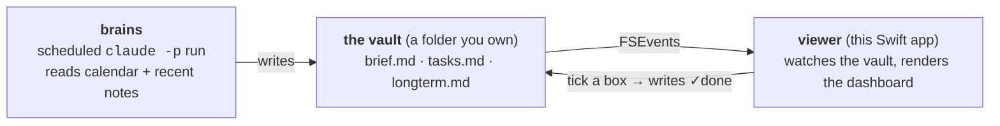

# Foolscap

A note widget that floats on your macOS desktop, backed by plain markdown in a folder
you own — **with a storage format designed so a coding agent can edit your notes using
ordinary file tools.** No API, no plugin, no sync service.

> **Status: pre-release.** It builds and launches, composes the four-section dashboard
> from a vault (`brief.md` / `tasks.md` / `longterm.md`), and the morning routine can
> write that vault. Reminders, the freshness/decision signals, and the tidy task
> rendering are still landing — see [ROADMAP.md](ROADMAP.md).

---

## Why this exists

Desktop sticky-note apps are a solved and crowded problem. This one is different in
exactly one way: **the file format is the API.**

Point Claude Code, or any agent that can read and write files, at `~/Notes` and it can
add a task, tick one off, restructure a page, or drop in a diagram. The widget watches
the folder and repaints. There is nothing to integrate — the integration is that both
sides agree to use markdown.

Foolscap is two halves joined only by the vault folder (see [DESIGN.md](DESIGN.md) →
"The two halves"): a scheduled **brains** run writes the files, and the **viewer** app
watches and repaints. The app has no API keys and makes no network calls of its own.



## The vault

`~/Notes` is the **vault root** — a folder you own. The panel composes a fixed set of
files from it into the dashboard; it is not a file browser.

```
~/Notes/                 # the vault root (path is configurable; see below)
├── CLAUDE.md            # the format, documented for agents — seeded on first run
├── brief.md             # Claude's morning recap + freshness stamp (Claude-owned)
├── tasks.md             # dated tasks, metadata-below format (shared)
├── longterm.md          # target-dated goals (shared)
└── notes/               # your loose notes — a soft convention the run reads for context
```

`CLAUDE.md` is written into the vault on first run, so any future Claude session picks
up the conventions without being briefed. The three dashboard files are optional: a fresh
vault renders gracefully empty until the morning routine (or you) writes them.

> **Naming collision.** The vault root is `Notes` (capital N) while `notes/` (lowercase)
> is just a loose subfolder inside it — easy to confuse. This ties into the open **Name**
> decision (ROADMAP.md → Open decisions); `foolscap` and these names are placeholders.

## Dates

Dates are plain inline text, not frontmatter and not a database — greppable, typeable,
and still readable if this app disappears.

```markdown
- [ ] Ask about compactness   due:2026-08-12
- [ ] Send Mei the sketch     due:2026-08-10
- [ ] Water the plants        every:week
- [x] Re-read §3.2            done:2026-08-11
```

| Field | Accepts | Behaviour |
|---|---|---|
| `due:` | `2026-08-19`, `2026-08-19T14:00`, `friday`, `+3d` | Sorts the Today view; amber within 2 days, red once overdue |
| `done:` | `2026-08-11` | Written for you when you tick the box |
| `every:` | `day`, `week`, `2weeks`, `month`, `mon,thu` | On completion the line is rewritten with the next `due:` |

Write `due:friday` and it normalises to the ISO date on save, so both you and an agent
can be loose while the file stays canonical.

**Dates are date-only and timezone-naive.** A task due the 19th is due the 19th in
Melbourne and in Reykjavík. This is deliberate.

## Themes

The panel renders in a `WKWebView`, so a theme is one CSS file.

| Theme | Ground | Feels like |
|---|---|---|
| `frosted` *(default)* | Translucent, retints to the wallpaper | Part of the OS |
| `card` | Opaque paper, ruled lines, slight tilt | An object on your desk |
| `console` | Near-opaque dark, monospaced | Another pane of your editor |

Drop any `*.css` into `~/.config/foolscap/themes/` and it appears in the menu.
See [design/mockup.html](design/mockup.html) for all three rendered against three wallpapers.

## Configuration

Everything is optional. Copy [`config.example.toml`](config.example.toml) to
`~/.config/foolscap/config.toml` and change what you care about.

```toml
vault      = "~/Notes"
theme      = "frosted"
start_mode = "preview"
```

`$FOOLSCAP_VAULT` overrides the vault path at launch.

## See it live

A fresh vault is empty, so to see the dashboard populated, point the app at the sample
vault checked into the repo (a synthetic fixture — never your real notes).

Build the app bundle and launch it against the fixture — this is the reliable way to get
the actual menu-bar panel. (`swift run foolscap` builds only the bare executable and won't
reliably surface as the menu-bar app; `build.sh` assembles a proper `Foolscap.app` with the
`Info.plist` + bundled themes/templates.)

```bash
./build.sh   # assembles dist/Foolscap.app
FOOLSCAP_VAULT=routines/morning-brief/fixtures/decision-day/vault dist/Foolscap.app/Contents/MacOS/Foolscap
```

`FOOLSCAP_VAULT` is inherited from the shell when you launch the bundled binary directly.
For everyday use against your own vault, `open dist/Foolscap.app` (or install it with
`cp -R dist/Foolscap.app ~/Applications/`).

Or render the dashboard straight to HTML without launching the panel at all:

```bash
swift run foolscap --dump-dashboard \
  routines/morning-brief/fixtures/decision-day/vault /tmp/foolscap-dash.html
```

That fixture uses fixed August 2026 dates, so on today's clock its tasks read as
overdue / long-term rather than a fresh-morning spread — it still populates all four
sections.

## Running the morning routine

The "brains" half is a scheduled **local** Claude Code run — a full headless agent loop
(`claude -p`), **not** an API call. It reads your calendar + recent notes and writes
`brief.md` / `tasks.md`.

```bash
routines/morning-brief/run.sh          # production: real vault, live calendar
routines/morning-brief/dry_run.sh all  # fixtures only — the test harness, no live calendar
```

- **Schedule** it daily at ~6am via launchd using
  `routines/morning-brief/com.foolscap.morning-brief.plist` — the install steps
  (`launchctl bootstrap`) are in that file's header comment. It's a
  `StartCalendarInterval` job, so a run missed while the Mac was asleep catches up on
  wake, with no extra code.
- **Live calendar** = today's events via the Google Calendar MCP tools; the `fixtures/`
  are for tests only.
- **Two first-run snags:** `claude` must be on `PATH` for launchd's minimal environment,
  and the Google Calendar MCP tool names hard-coded in `run.sh` may need matching to how
  the server is registered on your machine.

## Building

Requires macOS 14+ and a working Swift toolchain.

```bash
git clone https://github.com/Justin-Jonany/foolscap
cd foolscap
./build.sh
cp -R dist/Foolscap.app ~/Applications/
```

Foolscap is an ordinary app: it shows in the Dock and Cmd+Tab, plus a menu-bar item for
quick show/hide.

### Troubleshooting

**`error: this SDK is not supported by the compiler`** — your Command Line Tools
compiler and macOS SDK are from mismatched builds, which usually happens after a macOS
upgrade. Nothing Swift will compile, including `import Foundation`. Reinstall:

```bash
sudo rm -rf /Library/Developer/CommandLineTools
sudo xcode-select --install
```

If it persists, install Xcode from the App Store and run
`sudo xcode-select -s /Applications/Xcode.app`.

**"Foolscap is damaged and can't be opened"** — Gatekeeper on an unsigned build:

```bash
xattr -d com.apple.quarantine ~/Applications/Foolscap.app
```

## Repository layout

```
Sources/FoolscapCore/         Vault, TaskBlock (metadata-below parser), Dashboard
                              (four-section composer), dates, recurrence — no AppKit
Sources/Foolscap/             NSWindow, WKWebView, menu bar, dashboard render, config
Sources/FoolscapSelftest/     The logic suite — a plain executable, no Xcode needed
Sources/FoolscapRoutineCheck/ CLI that feeds a vault file through the parser (the routine's dry run uses it)
Resources/themes/             frosted.css, card.css, console.css
templates/CLAUDE.md           Written into a new vault on first run
routines/morning-brief/       The scheduled "brains" run: SKILL.md, run.sh, dry_run.sh,
                              the launchd plist, and fixtures/ (sample vaults + calendars)
design/mockup.html            The design, rendered
```

`FoolscapCore` deliberately imports no AppKit, so all parsing and date logic is
testable without a GUI session (`scripts/check-core-boundary.sh` enforces the boundary):

```bash
swift run foolscap-selftest                          # exits non-zero on failure
swift run foolscap --dump-dashboard <vault> out.html # render the dashboard headlessly
```

This is a plain executable rather than a `.testTarget` on purpose: XCTest and
swift-testing both ship only with Xcode, and requiring a 15GB install to check a
date parser is a bad trade.

## Contributing

See [CONTRIBUTING.md](CONTRIBUTING.md). [ROADMAP.md](ROADMAP.md) has a
*Good first issues* section that needs no architectural context.

## License

MIT — see [LICENSE](LICENSE).
