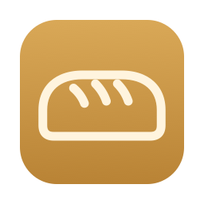
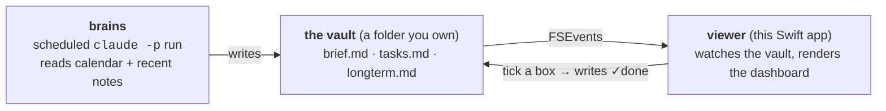

<p align="center">
  
</p>

<h1 align="center">Loaf</h1>

<p align="center"><b>A daily brief that writes itself, in plain markdown any agent can edit.</b></p>

An **agent-native** daily-briefing app for macOS — a small panel that floats on your
desktop, backed by plain markdown in a folder you own. No API and no sync service:
**the storage format is the interface, so any coding agent can read and write your
notes with ordinary file tools.** A scheduled Claude run fills it in each morning, and a
companion skill (`loaf-notes`, below) lets you jot to it in plain language.

**Status:** early, and in daily use. The panel, task write-back, archive, themes,
freshness stamp, and the morning routine all work; builds are unsigned and macOS 14+.
What's next is in [ROADMAP.md](ROADMAP.md).

<!-- Demo: watching the 6:30am brief land, then ticking a box and seeing the file change. -->

## Quick start

You need a Mac on macOS 14+ and [Claude Code](https://claude.com/claude-code). No clone,
no build.

1. For the brief to read your calendar, connect **Google Calendar** at claude.ai →
   Settings → Connectors.
2. In Claude Code, add Loaf and install it:
   ```
   /plugin marketplace add Justin-Jonany/loaf
   /plugin install loaf@loaf
   ```
3. Say **"set up loaf"**. Claude asks where your notes should live, installs the app,
   schedules the morning brief, and builds your first one.
4. From then on the brief writes itself each morning. Add tasks by telling Claude, e.g.
   *"add a task to call the dentist friday"*, and tick them off in the panel.

---

## Why I made this

I have trouble planning my day. I'm also too lazy to sit down and write a decent
to-do list — which means I procrastinate on writing one at all, which means the day
runs me instead of the other way around. Handing that job to Claude breaks the loop:
I'm not lazy about a list that writes itself. Checking the brief is the first thing I
do when I wake up.

That's the personal reason. The technical one is what made it worth building as an
app rather than a cron job and a text file: **the file format is the API.**

Desktop sticky-note apps are a solved and crowded problem; this one differs in exactly
one way. Point Claude Code, or any agent that can read and write files, at `~/Notes`
and it can add a task, tick one off, restructure a page, or drop in a diagram. The
widget watches the folder and repaints. There is nothing to integrate — the
integration is that both sides agree to use markdown.

Loaf is two halves joined only by the vault folder (see [DESIGN.md](DESIGN.md) →
"The two halves"): a scheduled **brains** run writes the files, and the **viewer** app
watches and repaints. The app has no API keys and makes no network calls of its own.



## A day with Loaf

The morning routine runs on its own at 6:30am, before I'm up — it reads my calendar
and recent notes and writes the brief.

I wake around 8:30, have breakfast, shower, then open the laptop to a brief that's
already written. I read it, add to it, tick off what's done.

When I remember something during the day for tomorrow or next week, I open Claude and
use the `loaf-notes` skill (below) — I type an incomplete sentence full of typos and it
puts the task in the right file, in the right format. I never touch `@due` or `·` tokens
by hand.

Coffee chats and one-off events just sit in my calendar; the morning routine catches
them and turns them into tasks on its own.

## Install

The [Quick start](#quick-start) above is the whole install. In detail, "set up loaf" (or
`/loaf:loaf-setup`) checks your macOS version and that `claude` is reachable for the
scheduled run, asks where your notes should live and whether to schedule the brief,
downloads the app from the latest release, checks your Google Calendar connection, and
offers to build today's brief. Re-run it any time to repair or update the setup; to pick
up a new version, run `claude plugin update loaf@loaf` in a terminal first.

Loaf is an ordinary app: it shows in the Dock and Cmd+Tab, plus a menu-bar item for
quick show/hide. It runs on defaults with no config file; see [Configuration](#configuration)
to change the vault path or theme.

### From source

With a Swift toolchain you can build it yourself instead:

```bash
git clone https://github.com/Justin-Jonany/loaf
cd loaf
./build.sh                          # assembles dist/Loaf.app
cp -R dist/Loaf.app ~/Applications/
./scripts/install.sh --schedule     # skills, config, and the morning schedule
```

`install.sh` copies what the morning run needs into `~/Library/Application Support/Loaf/`
and points the config and schedule there, so re-run it after pulling changes. Add
`--vault PATH` to use a folder other than `~/Notes`.

### Try it with the sample vault

A fresh vault is empty, so to see the dashboard populated, point the app at the sample
vault checked into the repo (a synthetic fixture — never your real notes):

```bash
LOAF_VAULT=routines/morning-brief/fixtures/decision-day/vault dist/Loaf.app/Contents/MacOS/Loaf
```

`LOAF_VAULT` is inherited from the shell when you launch the bundled binary directly
(`open` doesn't forward it). `swift run loaf` builds only the bare executable and won't
reliably surface as the menu-bar app, which is why `build.sh` assembles a proper
`Loaf.app` with the `Info.plist`, icons, and bundled themes/templates.

Or render the dashboard straight to HTML without launching the panel at all:

```bash
swift run loaf --dump-dashboard \
  routines/morning-brief/fixtures/decision-day/vault /tmp/loaf-dash.html
```

That fixture uses fixed August 2026 dates, so on today's clock its tasks read as
overdue / long-term rather than a fresh-morning spread — it still populates all four
sections.

### Schedule the morning routine

The "brains" half is a scheduled **local** Claude Code run — a full headless agent loop
(`claude -p`), **not** an API call. It reads your calendar + recent notes and writes
`brief.md` / `tasks.md`.

```bash
routines/morning-brief/run.sh          # production: real vault, live calendar
routines/morning-brief/dry_run.sh all  # fixtures only — the test harness, no live calendar
```

- **Schedule:** `loaf-setup` or `scripts/install.sh --schedule` installs
  `routines/morning-brief/com.loaf.morning-brief.plist` as a launchd job that tries from
  6am. It's a `StartCalendarInterval` job, so a run missed while the Mac was asleep
  catches up on wake, with no extra code. Remove it with
  `launchctl bootout gui/$(id -u)/com.loaf.morning-brief`.
- **Live calendar** = a rolling 7-day window (today through today+7) via the Google
  Calendar MCP tools; the `fixtures/` are for tests only.
- **Two first-run snags** (`loaf-setup` checks both): `claude` must be on `PATH` for
  launchd's minimal environment, and `run.sh` expects the claude.ai Google Calendar
  connector's tool names (`mcp__claude_ai_Google_Calendar__*`).

### Troubleshooting

**`this SDK is not supported by the compiler`** — Command Line Tools and macOS SDK are
from mismatched builds (usually after a macOS upgrade). Fix:

```bash
sudo rm -rf /Library/Developer/CommandLineTools
sudo xcode-select --install
```

Still failing? Install Xcode from the App Store and run
`sudo xcode-select -s /Applications/Xcode.app`.

**"Loaf is damaged and can't be opened"** — Gatekeeper flagging an unsigned build:

```bash
xattr -d com.apple.quarantine ~/Applications/Loaf.app
```

## Two skills for talking to your vault

**`loaf-notes`** is half the point. You're mid-something and think "oh — I have to submit
my taxes." You don't want to stop, open the vault, and remember the date format. So you
don't: open Claude anywhere and say it however it comes out. `loaf-notes` is a Claude Code
skill that knows where your vault is and how a task is written, so a typo-ridden fragment —
*"submit taxs b4 apr 15"* — lands as a correctly-formatted, correctly-dated task in
`tasks.md`. The panel repaints; you never opened a file. Just talk to Claude: *"add a task
to call the dentist friday," "mark the expense report done," "focus on the proposal
today."* It edits `tasks.md` / `longterm.md` and leaves `brief.md` (Claude's own) alone.

**`loaf-brief`** is for when the 6am run didn't fire — the Mac was asleep past its
catch-up window, or you just want a fresh read before a big day. It wraps
`routines/morning-brief/run.sh --force`, so "rebuild my brief" gets you an up-to-date
`brief.md` on demand without opening a terminal.

Both ship in [`skills/`](skills/) and come with the plugin. From a clone,
`./scripts/install.sh` copies them into `~/.claude/skills/` instead. Either way, the
`contract` line in `~/.config/loaf/config.toml` tells both skills where to find
`TASK-FORMAT.md`. Installed copies are independent — editing one never touches the repo —
so re-run the installer after changing a skill in the repo.

## The vault

`~/Notes` is the **vault root** — a folder you own. The panel composes a fixed set of
files from it into the dashboard; it is not a file browser.

```
~/Notes/                 # the vault root (path is configurable; see below)
├── CLAUDE.md            # your personal notes for Claude — seeded on first run
├── brief.md             # Claude's morning recap + freshness stamp (Claude-owned)
├── tasks.md             # dated tasks, metadata-below format (shared)
├── longterm.md          # target-dated goals (shared)
└── notes/               # your loose notes — a soft convention the run reads for context
```

`CLAUDE.md` is seeded into the vault on first run for *your* context — tone, priorities,
the people in your life — not the task format. That's authored once, in the repo's
[`TASK-FORMAT.md`](TASK-FORMAT.md), and the skills and the morning routine read it
directly, so a vault's `CLAUDE.md` never needs touching when the format changes. The
three dashboard files are optional: a fresh vault renders gracefully empty until the
morning routine (or you) writes them.

Mind the case: `Notes` (capital N) is the vault root, while `notes/` (lowercase) is just a
loose-notes subfolder inside it.

## Dates

Dates are plain text, not frontmatter and not a database — greppable, typeable, and
still readable if this app disappears. A task's metadata lives on an indented line
**beneath** the checkbox, tokens separated by ` · `, so the task itself still reads as
a plain sentence:

```markdown
- [ ] Prep the client deck
      @20aug · !high · #schoolwork · calendar
      Focus on the pricing slide — they pushed back last time.
- [ ] Email the landlord
      @today · manual
- [x] Read chapter 4
      @fri · #cs101 · ✓18aug
```

| Token | Required? | Meaning |
|---|---|---|
| `@due` | **required** | `@today`, a weekday (`@fri`), a day-month (`@20aug`), or ISO (`@2026-08-19`). Weekday/day-month resolve to the nearest occurrence going forward. Buckets the task into Today / This week / Long-term; renders amber within 2 days, red once overdue. |
| `source` | **required** | `calendar` · `chat` · `manual` — `manual` may be omitted, it's the implicit default. |
| `✓done` | auto | Stamped (e.g. `✓18aug`) when you tick the box. |
| `!priority` | optional, on-command only | `!high` / `!med` / `!low`. Absent = normal; Claude only adds this when you ask. |
| `#type` | optional | A category tag: `#schoolwork`, `#cs101`, whatever fits. |
| `today` (or legacy `★`) | optional | **Focus flag** — pulls the task into Today regardless of `@due`. You set this from the panel; the morning routine never writes it. |
| `every:` | optional | Recurrence (`every:week`, `every:2weeks`, `every:month`, `every:mon,thu`). On completion, `@due` is rewritten to the next occurrence. |
| a note | optional | Free prose on a further-indented line below the metadata — context for the task, like the "Focus on the pricing slide" line above. |

`@due` and `source` are the two that matter; the rest are there when you want them.
Write `@fri` and it normalizes to the ISO date on save, so both you and an agent can be
loose while the file stays canonical.

**Dates are date-only and timezone-naive.** A task due the 19th is due the 19th in
Melbourne and in Reykjavík. This is deliberate.

## Themes

The panel renders in a `WKWebView`, so a theme is one CSS file.

| Theme | Ground | Feels like |
|---|---|---|
| `frosted` *(default)* | Translucent, retints to the wallpaper | Part of the OS |
| `card` | Opaque paper, ruled lines, slight tilt | An object on your desk |
| `console` | Near-opaque dark, monospaced | Another pane of your editor |

Five more ship ready-made in `Resources/themes/`, each just a different `:root` token
set on the shared base, and all show up in the menu automatically:

- **`daylight`** — clean, bright, always-light; a modern light mode, no paper texture
- **`sepia`** — warm parchment reading mode, easy amber tones
- **`nord`** — arctic, cool blue-grays; an opaque dark alternative to `console`
- **`solarized-light`** / **`solarized-dark`** — Ethan Schoonover's Solarized, both variants

Pick any of them live from the menu bar — no restart. Drop your own `*.css` into
`~/.config/loaf/themes/` and it appears in the menu too. See
[design/mockup.html](design/mockup.html) for the three flagship themes rendered against
three wallpapers.

## Configuration

Everything is optional — Loaf runs on defaults with no config file at all. Settings live
in `~/.config/loaf/config.toml`: `~/.config/` is the conventional per-user spot for app
and CLI config on macOS and Linux (the XDG "config home"), which keeps dotfile clutter
out of your home directory. Copy [`config.example.toml`](config.example.toml) there and
change only what you care about.

```toml
vault      = "~/Notes"      # where your notes live (tilde expanded); $LOAF_VAULT wins over this
theme      = "frosted"      # any built-in, or a *.css file you drop in ~/.config/loaf/themes/
start_mode = "preview"      # "preview" renders the markdown; "source" shows the raw text

[dates]
soon_within_days = 2        # tasks due within this many days render as "soon" (amber)
week_starts      = "monday" # anchors every:week and relative dates: "monday" or "sunday"
```

`$LOAF_VAULT` overrides the vault path at launch. The `theme` line is also rewritten for
you when you pick a theme from the menu bar, so a live switch persists to the next launch.

## Repository layout

```
Sources/LoafCore/             Vault, TaskBlock (metadata-below parser), Dashboard
                              (four-section composer), dates, recurrence — no AppKit
Sources/Loaf/                 NSWindow, WKWebView, menu bar, dashboard render, task
                              write-back, notifications, and the --demo-* CLI commands
Sources/LoafSelftest/         The logic suite — a plain executable, no Xcode needed
Sources/LoafRoutineCheck/     CLI that feeds a vault file through the parser (the routine's dry run uses it)
Resources/                    Info.plist, app + menu-bar icons, and 8 theme CSS files (see Themes)
logo/                         SVG sources for the icons; scripts/make-icons.sh re-renders them
TASK-FORMAT.md                Single source of truth for the task format — read directly by
                              both skills and the morning routine, never restated elsewhere
templates/CLAUDE.md           Personal-notes-for-Claude seed, written into a new vault on first run
.claude-plugin/               Claude Code plugin + marketplace manifests (the repo is the plugin)
scripts/install.sh            Installs the routine's runtime copy, config, skills, and schedule
scripts/install-app.sh        Downloads the latest release into ~/Applications (used by loaf-setup)
scripts/test-install.sh       Checks both installers against a throwaway HOME (runs in CI)
routines/morning-brief/       The scheduled "brains" run: SKILL.md, run.sh, dry_run.sh,
                              the launchd plist, and fixtures/ (sample vaults + calendars)
skills/loaf-notes/            The loaf-notes Claude Code skill — jot/edit tasks in plain language
skills/loaf-brief/            The loaf-brief Claude Code skill — rebuild today's brief on demand
skills/loaf-setup/            The loaf-setup skill (plugin only) — install, schedule, and first run
design/mockup.html            The design, rendered
```

`LoafCore` deliberately imports no AppKit, so all parsing and date logic is
testable without a GUI session (`scripts/check-core-boundary.sh` enforces the boundary):

```bash
swift run loaf-selftest                          # exits non-zero on failure
swift run loaf --dump-dashboard <vault> out.html # render the dashboard headlessly
```

This is a plain executable rather than a `.testTarget` on purpose: XCTest and
swift-testing both ship only with Xcode, and requiring a 15GB install to check a
date parser is a bad trade.

## Contributing

See [CONTRIBUTING.md](CONTRIBUTING.md). [ROADMAP.md](ROADMAP.md) has a
*Good first issues* section that needs no architectural context, and
[DECISIONS.md](DECISIONS.md) logs why past architectural calls landed where they did.

## License

MIT — see [LICENSE](LICENSE).
