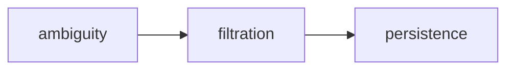

# This is a Foolscap vault

These notes are displayed live in a desktop widget. Edit them with ordinary file
tools — the widget watches this folder and repaints when a file changes. There is no
API and no command to run.

## Format

Every note is a markdown file in this directory. Subdirectories are notes too, except
`attachments/`, which holds images.

Tasks are GitHub-flavoured checkboxes:

```markdown
- [ ] not done
- [x] done
```

## Dates

Attach dates as inline `key:value` at the end of a task line. Always ISO 8601
(`YYYY-MM-DD`), optionally with `THH:MM`.

```markdown
- [ ] Ask about compactness   due:2026-08-12
- [ ] Water the plants        every:week
- [x] Re-read §3.2            done:2026-08-11
```

| Field | Meaning |
|---|---|
| `due:` | When it's due. Drives sorting and colour. |
| `done:` | When it was completed. Add this when you tick a box. |
| `every:` | Recurring — `day`, `week`, `2weeks`, `month`, or `mon,thu`. |

Rules:

- **Dates are date-only and timezone-naive.** Never convert to UTC, never attach an
  offset. A task due the 19th is due the 19th everywhere.
- When you tick a box, add `done:` with today's date in the user's local calendar.
- Don't delete completed tasks unless asked. The user decides when to prune.
- Keep one task per line. Sub-tasks are indented two spaces.

## Diagrams and images

Mermaid fences render in the widget:

````markdown

````

Images live in `attachments/` and are referenced relatively:

```markdown

```

## Conventions

- `todo.md` is the default inbox. If the user says "add a task" with no other context,
  it goes there.
- `daily/YYYY-MM-DD.md` are daily notes. Today's is created automatically.
- Preserve the user's existing heading structure and ordering. Append rather than
  reorganise unless asked.
- These files are the user's own notes. Don't reformat, rewrite, or "tidy" prose that
  wasn't part of the request.
